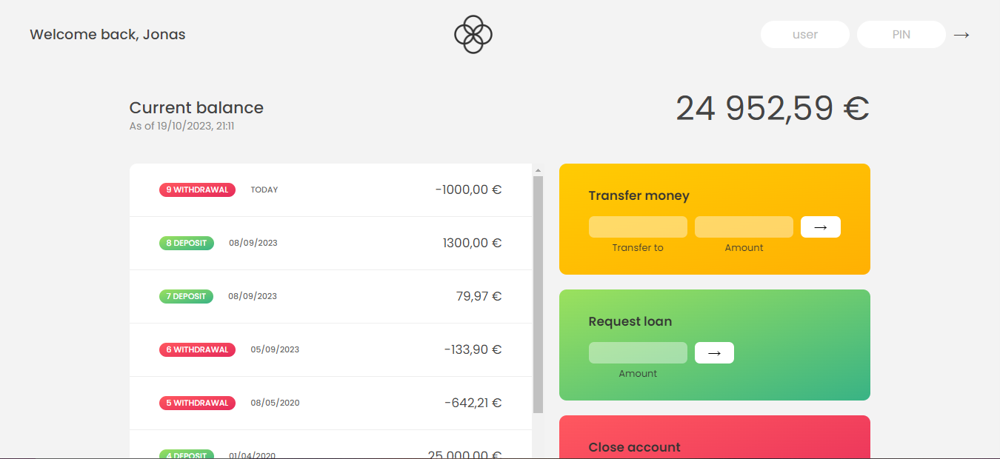
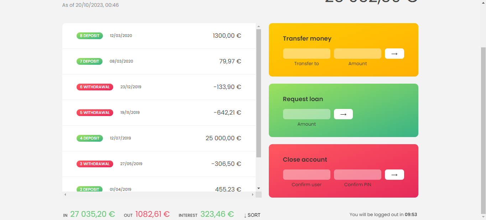

# Bankist-App
Bu uygulamada basit bir bankacı uygulamasını The Complate Javascript Course - 'Jonas Schmedtmann' eşliğinde  oluşturdum.

###  1- 🙋‍♂️ Uygulamayı kullanabilmek için gerekli olan kullanıcı bilgileri :
* Kullanıcı 1 'Jonas Shmedthmann' :  
user : js / PIN  : 1111  
* Kullanıcı 2 'Jessica Davis' :  
user : jd / PIN  : 2222  
###  2- 🙇‍♂️ Kullanıcı rolü ile yapabilecekleriniz .
* Kullanıcı hesabına giriş yapıp toplam gelirlerini, toplam giderlerini, her bir girdi çıktı hareketlerini  
toplam mevcut bakiyesini ve faiz miktarını görebilir.
* Kullanıcı diğer kullanıcıya para gönderimi yapabilir.
* Kullanıcı kredi çekme isteğinde bulunabilir. [İstenen kredi kullanıcının para yüklemelerinin en az birisinin %10'undan daha düşükse onaylanır]
* Kullanıcı mevcut hesabını kapatabilir.
* Kullanıcı tüm hareketlerini Gelir-Gider şeklinde sıralayabilir.
### 3- 🛠 Uygulamayı oluştururken kullandığım teknolojiler :
* 
* 
* 
### 4- 💻 Projenin kurulumu :
* Projenin kurulumu için herhangi bir API veya Bundler gerekmemektedir.
## :phone: İletişim

 

   
<b> <samp> İletişime Geçin </samp></b>

    
   <samp>
   <b><h2 style="color: #fc6203">KADIR&nbsp;KARABACAK </h2></b>
   
      
     Projenin Linki: <a href="https://github.com/KadirKarabacak/Bankist-App">Bankist App</a>
      
      
     LinkedIn: <a href="https://www.linkedin.com/in/kadir-karabacak-/"> LinkedIn Hesabım</a>
      
     Instagram: <a href="https://www.instagram.com/kadir_krbck_/"> Instagram Hesabım</a>
      
     Mail Adresim: <a href="#"> kadirht@hotmail.com</a>
   </samp>
 

